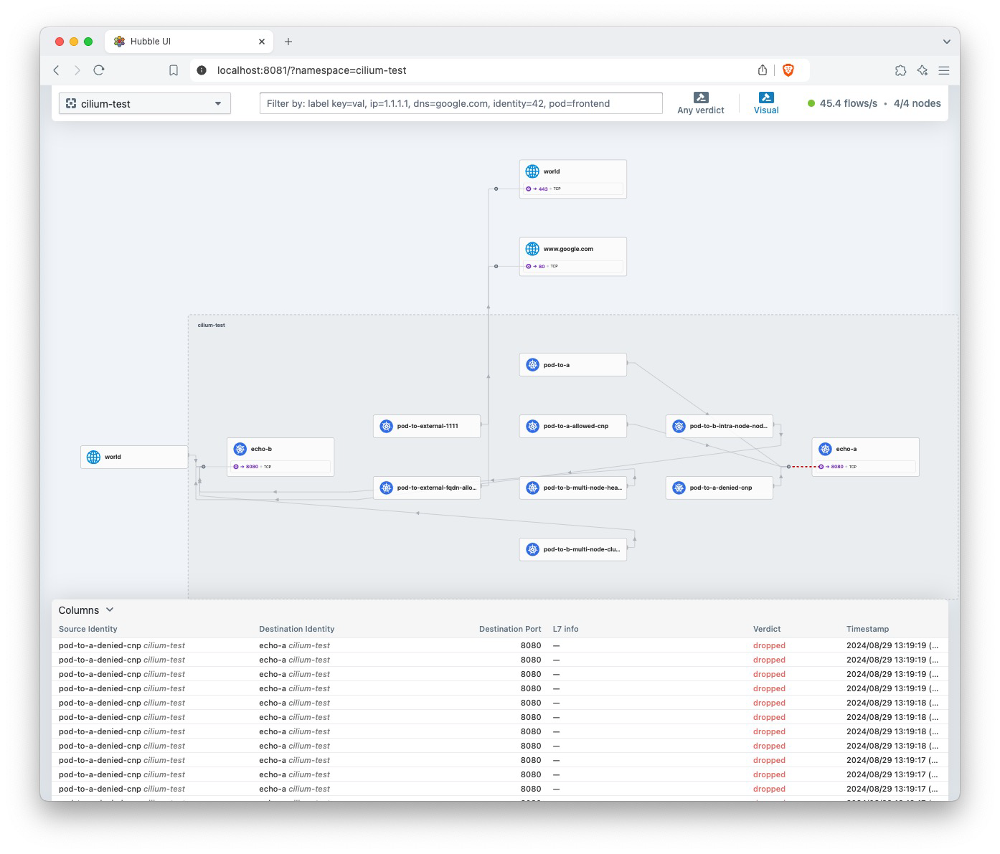

_There will be a circling back to provide more detail, but there's been quite a bit of interest so we're pushing forward with the cleaned up configuration and minimal instructions. Thank you for your patience_

## Kind Guide

This guide is here to walk you through the commands being run to setup the environment in a local kind cluster. 

Steps:

1. `make kind-cluster-create`

2. `make helm-repos`

3. `make cilium-helm-install`

4. (Optional) `make cilium-test` (cleanup `make cilium-test-delete`)
* If all the pods enter the `Running` state, things are all working as expected. 
* If you port forward the hubble ui (`make cilium-hubble-ui`), you will see the pods and connections build up as the tests are started. 

Alternatively you can run `cilium connectivity test` if you have installed the Cilium cli, note that you will need to clean up the resources at the end of the connectivity test as well. 

5. `make tetragon-helm-install`

6. `make alpine-apply` - Create a debug Alpine container to the kubernetes cluster for arbitrary execution
  1. `make alpine-bash` - Exec into the container to run any commands you would like
  1. `make alpine-tetragon-watch` - In a secondary terminal, you can watch tetragon report on the commands you run inside of the alpine container in the first terminal
    1. `make tetragon-logs` - Will show you all of the process executions that tetragon is able to observe across the whole cluster 
    1. Take a look inside the Makefile to customize either command and see some of the other Pods you have running or add more Pods and check out their processes

## Cleanup

1. `make kind-cluster-delete`
Everything that we ran was operating inside of Kind, so we just have to delete the kind cluster and the resources will be cleaned up.

There will be lingering artifacts like your Helm repository configuration, the docker image for the Kind nodes.